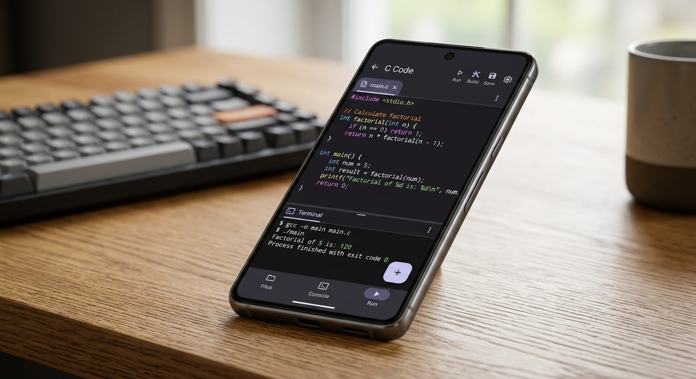

#  C Code

<p align="center">
  
</p>

<p align="center">
  <a href="https://android-arsenal.com/details/1/8888"></a>
  <a href="https://github.com/Niloy-Track-Dev/C-Code/releases"></a>
  <a href="LICENSE"></a>
  <a href="https://kotlinlang.org/"></a>
  <a href="https://developer.android.com/jetpack/compose"></a>
</p>

<p align="center">
  <b>A professional, 100% offline C IDE and high-performance compiler for Android.</b><br>
  Built with Material You, featuring a sandboxed execution engine and comprehensive C grammar support.
</p>

---

## ✨ Features

- 🚀 **100% Offline Engine**: Compile and run C code entirely on-device. No internet, no latency, no data collection.
- 🎨 **Material You Design**: Beautiful, responsive interface that adapts to your system colors (Dynamic Color support).
- 🛠️ **Advanced Editor**: 
  - Real-time syntax highlighting for C keywords, types, and macros.
  - Auto-close brackets, quotes, and smart indentation.
  - Multi-tab terminal with Stdin support and performance metrics.
- 🔍 **Powerful Diagnostics**: Abstract Syntax Tree (AST) based error detection with line-specific jump-to-problem logic.
- 📂 **Project Management**: Organize your code with a robust project system. Rename, duplicate, and export projects as `.c` files.
- 🧩 **Smart Snippets**: Built-in library of common C templates (loops, structs, sorting algorithms) for faster coding.
- 📦 **Sandboxed Execution**: Memory-safe execution with timeout guards and infinite loop protection.

## 📸 Screenshots

<p align="center">
  
</p>

## 🏗️ Architecture

**C Code** is built using modern Android development standards:

- **UI Framework**: [Jetpack Compose](https://developer.android.com/jetpack/compose) for a declarative, fluid UI.
- **Concurrency**: [Kotlin Coroutines](https://kotlinlang.org/docs/coroutines-overview.html) & Flow for non-blocking compilation.
- **Local Persistence**: [Room Database](https://developer.android.com/training/data-storage/room) for secure, on-device project storage.
- **Compiler Core**: A custom-built recursive descent parser and memory-safe virtual execution engine.
- **Theming**: Full Material 3 implementation with dynamic color support (Android 12+).

## 🛠️ Building

To build the project from source, you'll need the latest version of Android Studio (Hedgehog or newer).

1. Clone the repository:
   ```bash
   git clone https://github.com/Niloy-Track-Dev/C-Code.git
   ```
2. Open the project in Android Studio.
3. Sync Project with Gradle Files.
4. Run the `app` module on your device or emulator.

## 🤝 Contributing

Contributions are welcome! If you'd like to improve the compiler engine or add new editor features:

1. Fork the Project.
2. Create your Feature Branch (`git checkout -b feature/AmazingFeature`).
3. Commit your Changes (`git commit -m 'Add some AmazingFeature'`).
4. Push to the Branch (`git push origin feature/AmazingFeature`).
5. Open a Pull Request.

## 📜 License

Distributed under the **GPL v3.0 License**. See `LICENSE` for more information.

---

<p align="center">
  Made with ❤️ by <a href="https://github.com/Niloy-Track-Dev">Niloy Mitra</a>
</p>
